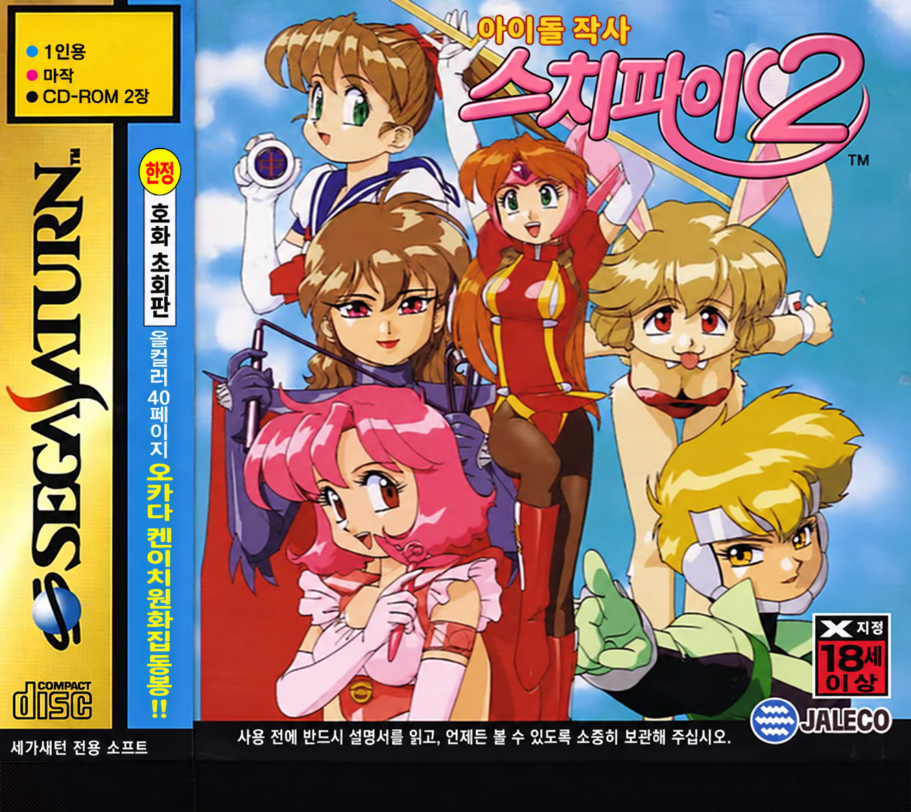
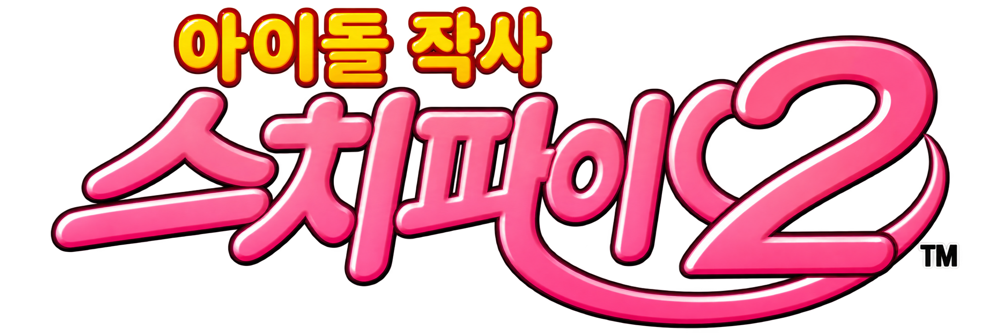

<p align="center"></p>

# 아이돌 작사 스치파이2 (Idol Janshi Suchie-Pai II) 세가새턴판 한글 패치

<p align="center"></p>

## 게임 소개

**아이돌 작사 스치파이2**(アイドル雀士スーチーパイⅡ, Idol Janshi Suchie-Pai II)는 쟈레코(Jaleco)가 만든 마작 게임입니다. 1994년 12월 아케이드로 처음 나왔고, 1996년에 세가새턴과 플레이스테이션으로 이식되었습니다. 이 저장소가 다루는 것은 **세가새턴 일본판**(품번 T-5705G)입니다.

- **장르**: 컴퓨터 상대와 1대1로 치는 2인 마작. 대국에서 이기면 이야기가 진행되고 상대 캐릭터의 벌칙(탈의) 연출이 나옵니다.
- **캐릭터**: 원화는 『건스미스 캣츠』로 알려진 **소노다 켄이치**(園田健一)가 맡았습니다. 마작으로 악과 싸우는 변신 히로인 "스치파이"와 개성 강한 적 캐릭터들이 등장합니다.
- **구성**: CD-ROM 2장. 1번 디스크가 본편, 2번 디스크는 오마케(おまけ, 부록) 디스크입니다.
- **등급**: 원판은 18세 이상 이용가(X 지정)입니다.

## 이 저장소

이 게임의 한글화 도구와 번역 데이터를 두는 곳입니다. **원본 디스크 이미지(BIN/CUE)는 들어 있지 않고, 앞으로도 커밋하지 않습니다.** 사용자가 가진 원본 디스크 이미지에서 한글판 이미지를 만들어 내는 방식으로 배포합니다.

지원 대상 원본 (Redump 기준 이름):

| 디스크 | 파일 |
|---|---|
| 1번 (본편) | `Idol Janshi Suchie-Pai II (Japan) (Disc 1).cue` + Track 1 (데이터), Track 2 (오디오) |
| 2번 (오마케) | `Idol Janshi Suchie-Pai II (Japan) (Disc 2) (Omake Disc).cue` + Track 1 (데이터), Track 2 (오디오) |

트랙별 크기·해시는 분석 단계에서 기록하고, 빌드할 때 원본이 맞는지 먼저 확인합니다.

## 현재 상태

**v0.5 — 개발판** (검수 전 번역이 들어 있어 배포용 아님). 들어 있는 것:

- 한글 타이틀 로고 (제공 로고 `title_logo.png`를 원래 스프라이트 3칸과 팔레트에 맞춰 넣음, 사람 확인 대기)
- 메뉴 그림 글자 58개 (`SELECT1.BIN`: 메뉴·난이도·파트너 선택·사운드 테스트·스테이지 선택, 초벌 번역·검수 대기)
- 대국 화면 그림 글자 104개 (스테이지 오버레이 13개: 이름·버튼·안내·선언·역 이름 등, 초벌 번역·검수 대기)
- 상대 소개 카드 17개와 저장 안내 1개 (`AP*.BIN` 11개, 초벌 번역·검수 대기)
- 오프닝(데모) 캐릭터 소개 이름표 46개 (`PROLOG.BIN` 압축 블록: 별명·이름·성우, 초벌 번역·검수 대기)
- 패널 매치(보너스 게임) 세로 안내문 92줄 (`PMATCH.BIN`, 초벌 번역·검수 대기, 그림 위 글자 32항목은 아직)
- 첫 부팅 안내 화면 5줄 (`BACKRAM.BIN` 워드 RLE 압축 블록, 초벌 번역·검수 대기)
- 타이틀 선택지 「最初から／続きから」 → "처음부터 시작 / 이어서 시작" (표기 승인, 화면 표시는 미확인)
- 오프닝 큰 글자 「アイドル雀士スーチーパイⅡ」 → "아이돌 작사 스치파이 2" (`PROLOG.BIN` 압축 블록, 남는 칸 2개는 하트 장식)
- 제품 빌드 도구: LZSS·워드 RLE 압축·해제(게임 해제 방식과 같은 형식), 스프라이트 묶음(Yc), ISO9660, 섹터 EDC/ECC, 쓰기 계획, 그림 글자 렌더러

## 번역 데이터

| 파일 | 내용 |
|---|---|
| [`translation/select1.json`](translation/select1.json) | 메뉴 그림 글자 58개(원문 받아쓰기·원본 해시·번역·상태·메모)와 제외 항목 81개(근거) |
| [`translation/glossary.json`](translation/glossary.json) | 용어·표기 결정 (승인 / 제안) |
| [`translation/match.json`](translation/match.json), [`match2.json`](translation/match2.json) | 대국 화면 그림 글자 104개와 제외 항목 |
| [`translation/cards/`](translation/cards/) | 상대 소개 카드·저장 안내 18개 (파일별 번역 표 11개) |
| [`translation/opening.json`](translation/opening.json) | 오프닝 캐릭터 소개 이름표 46개와 제외 항목 1개 |
| [`translation/letters.json`](translation/letters.json) | 오프닝 큰 글자 12칸 |
| [`translation/title_labels.json`](translation/title_labels.json) | 타이틀 선택지 1개와 제외 항목 10개 |
| [`translation/boot_notice.json`](translation/boot_notice.json) | 첫 부팅 안내 5줄과 제외 항목 3개 |
| [`translation/panel.json`](translation/panel.json) | 패널 매치 안내문 92줄·남은 횟수 칸, 미번역 그림 글자 32항목(`untranslated`), 제외 80개 |
| [`assets/select1/layout.json`](assets/select1/layout.json), [`assets/match/`](assets/match/), [`assets/cards/`](assets/cards/), [`assets/opening/`](assets/opening/) | 그림 글자 배치 (편집 영역, 배경 복원 방식, 글자 크기·색 번호) |

번역문 규칙: `\n`은 줄바꿈, `|`는 글자 색 구간 경계. 상태는 `needs_review` → `needs_human_review` → `distribution_eligible`. 모든 항목이 `distribution_eligible`이 되고 타이틀 로고가 승인되기 전까지 빌드 결과는 `distribution: false`입니다.

조사 기록은 [`docs/initial-survey.md`](docs/initial-survey.md)에 있습니다.

## 준비물

- Python 3.11 이상, [Pillow](https://pypi.org/project/Pillow/) 9.4 이상, pytest (테스트용)
- 나눔스퀘어라운드 ExtraBold (`/usr/share/fonts/truetype/nanum/NanumSquareRoundEB.ttf`, 데비안 `fonts-nanum-extra`)
- 원본 1번 디스크 BIN/CUE (Redump `Idol Janshi Suchie-Pai II (Japan) (Disc 1)`). 트랙 SHA-1이 다르면 빌드가 거부합니다.
  - Track 1: `90efa69e3b3f89503e356d6d6f5112ff8a541f1d`
  - Track 2: `5328aad6e81dc43b59ccde73ada1f51c930be5e4`

## 사용법

```sh
# 한글판 만들기 → out/ 에 BIN/CUE와 manifest.json
python3 tools/khpatch.py build --source "/경로/Idol Janshi Suchie-Pai II (Japan) (Disc 1).cue"

# 대조군: 타이틀 그림은 그대로 두고 압축만 다시 한 디스크 (압축기 호환 확인용)
python3 tools/khpatch.py build --source "/경로/...(Disc 1).cue" --out out/control --title original --select1 original --match original --cards original --opening original --boot original --panel original

# 테스트
python3 -m pytest -q tests
```

빌드는 원본 트랙 해시와 바꿀 영역의 원본 바이트를 확인한 뒤, 모든 변경을 섹터 단위 쓰기 계획으로 등록하고(원본 기대값 확인, 겹침 거부, 최종 차이 감사) 한 번에 적용합니다. 로고가 원래 스프라이트 칸 밖으로 나가거나 압축 결과가 원래 자리보다 크면 빌드가 실패합니다.

## 한글화 방향

### 범위

조사 결과 이 게임의 대화는 **자막 없이 음성으로만** 나오고, 화면의 일본어는 대부분 그림 글자입니다([`docs/initial-survey.md`](docs/initial-survey.md)). 그래서 아래 순서로 진행합니다.

1. **1번 디스크(본편)의 그림 글자 먼저.** 타이틀 로고(제공된 `title_logo.png`), 메뉴, 파트너 선택, 상대 소개 카드, 대국 화면 표시, 역(役) 이름, 결과·엔딩 화면 글자를 한글 그림으로 바꿉니다.
2. **자막은 그다음에 판단합니다.** 한 장면에 한국어 자막을 넣는 시험(PoC)으로 비용을 잰 뒤, 전체 대사에 자막을 넣을지 정합니다. 원문 대본이 디스크에 없어서 자막을 넣으려면 음성 받아쓰기부터 해야 합니다.
3. **2번 디스크(오마케)는 본편이 끝난 뒤** 글자가 있는 부분을 조사해서 범위를 정합니다.
4. **음성은 원어(일본어) 그대로** 둡니다.
5. 영어로 된 그림 글자와 회사 로고는 그대로 둡니다.

### 번역 원칙

- **캐릭터·성우 이름**은 일본어 발음대로 통용 표기로 적습니다(예: 츠카사, 쿄코, 마츠모토 리카). 작품 제목의 "스치파이"는 표지·로고 표기에 맞춥니다.
- **마작 용어**는 국내 마작 커뮤니티에서 흔히 쓰는 음역을 씁니다. 예: 리치, 퐁, 치, 깡, 론, 쯔모, 도라, 텐파이, 노텐. 역 이름도 같은 방식(예: 핑후, 탕야오, 이페코)으로 적고, 결정한 표기는 용어집에 모아 둡니다.
- **말투**는 캐릭터마다 원작의 성격을 살립니다. 변신 히로인의 대사, 악역의 대사, 해설 문구는 서로 다른 말투로 구분합니다.
- **글자 칸 제한.** 그림 글자는 원래 그림 크기 안에 들어가게 다듬습니다. 넘치면 빌드가 실패하게 만들어, 게임 화면에서 글자가 잘리지 않게 합니다.
- **검수.** 초벌 번역 → 독립 2차 검수 → 사람 검수 순서로 진행하고, 번역 표의 상태 값으로 어디까지 왔는지 기록합니다.

### 기술 방향

- 디스크 이미지 안의 파일 시스템(ISO 9660)과 게임 실행 파일을 분석해 대사 엔진, 글꼴, 문자 코드를 찾습니다.
- 원본 글꼴에 한글 글리프를 넣고, 필요한 만큼의 한글 글자에 코드를 새로 배정합니다.
- 번역 표(JSON)에서 대사를 다시 넣어 한글판 디스크 이미지를 만드는 과정을 스크립트 하나로 재현할 수 있게 합니다. 번역이 하나도 없으면 결과가 원본과 바이트 단위로 같아야 합니다.
- 변경은 모두 "원본에 있어야 할 바이트"를 확인한 뒤에 적용하고, 겹치거나 설명되지 않는 변경은 거부합니다.
- 에뮬레이터(Mednafen / Beetle Saturn 등)로 실제 화면을 확인하고, 확인한 화면은 번역 표에 기록합니다.

## 버전

| 버전 | 의미 |
|---|---|
| **v1.0** | **정식판**. 1번 디스크의 모든 그림 글자(자막을 넣기로 하면 자막 포함)가 사람 검수를 통과한 첫 버전 |
| v0.x | 개발판. 검수 전 번역이 들어 있음 |

## 권리

- 이 저장소에는 원본 디스크 이미지나, 원본에서 뽑아낸 그래픽·글꼴·음성 덤프를 넣지 않습니다.
- 원작 게임의 권리는 쟈레코와 각 권리자에게 있습니다. 합법적으로 가진 원본에만 적용하세요.
- 나눔스퀘어라운드는 SIL Open Font License입니다(저장소에 포함하지 않고 시스템 글꼴을 사용).
- 번역 표의 `ja` 필드에는 그림 글자에서 옮겨 적은 원문 문자열이 들어 있습니다(재삽입·검수에 필요).
- `cd_ko.png`(한글판 표지)와 `title_logo.png`(한글 로고)는 프로젝트 소유자가 만든 이미지이며, 원작 캐릭터 그림과 로고 디자인을 바탕으로 합니다. 배포 전에 이용 권리를 확인해야 합니다.
